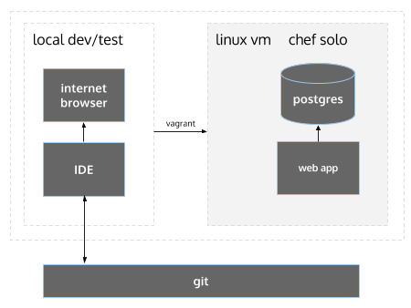

Create a local self contained environment for app deployment.

Includes Ruby, Rails, Nginx/Passenger, Java, PostgreSQL, Node.js, npm, bower, elasticsearch.



## 1. Installation reqs

* VirtualBox (tested w/ 4.3.20) - https://www.virtualbox.org/wiki/Downloads
* Vagrant (tested w/ 1.7.2) - http://www.vagrantup.com/downloads
* Ruby (tested w/ 2.1.4) 
```
\curl -sSL https://get.rvm.io | bash -s stable
```

NOTE: ISSUES MAY OCCUR ON OLDER VERSIONS

## 2. Get going

Install vagrant omnibus plugin so we can specify version of chef solo in our vagrantfile

```
vagrant plugin install vagrant-omnibus
```

Clone the repo

```
git clone git@github.com:stelligent/stelligent_commons.git
```

Navigate into the dev-box-generation.

```
cd local_dev_box/dev-box-generation
```

Stand it up

```
vagrant up
```

Creates a new Linux VM, currently Ubuntu 14.04, then installs the cookbooks with Chef.

NOTE: if you are on a Mac and receive an error that looks like: "clang: error: unknown argument: '-multiply_definedsuppress' [-Wunused-command-line-argument-hard-error-in-future]", you may need to run the "gem install berkshelf -v 3.1.4" command as: "sudo ARCHFLAGS=-Wno-error=unused-command-line-argument-hard-error-in-future gem install berkshelf -v 3.1.4"

## 3. Verify

```
vagrant ssh
ruby -v
rails -v
java -version
...
```

## 4. Creating a local dev .box for developers

Make the box as small as possible

```
sudo apt-get clean
sudo dd if=/dev/zero of=/EMPTY bs=1M
sudo rm -f /EMPTY
cat /dev/null > ~/.bash_history && history -c
```

Logout of the box and export

```
vagrant package --output [mynew].box
```

## 5. Vagrant Commands

To restart the VM and re-provision

```
vagrant reload --provision
```

Clean shutdown

```
vagrant halt
```

Remove the VM completely

```
vagrant destroy
```

Start again

```
vagrant up
```
